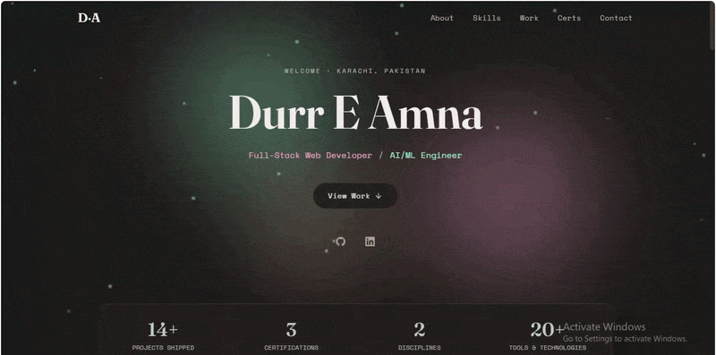

# Durr E Amna — Portfolio

A dark, living portfolio built with **React + Vite + Tailwind CSS + Framer Motion**.
Dual-lens design: one toggle splits the work into **AI/ML** and **Design / Full-Stack**.

Preview:



demo link: https://portfolio-pi-sooty-20.vercel.app/
## Run it

```bash
npm install      # install dependencies
npm run dev      # local dev server (http://localhost:5173)
npm run build    # production build → dist/
npm run preview  # preview the production build
```

## Structure

```
src/
├── main.jsx                 entry point
├── App.jsx                  composes every section
├── index.css                Tailwind + base styles
│
├── data/                    ← edit your content HERE
│   ├── projects.js          all projects (both lenses), tech tags, status
│   ├── skills.js            skill panels
│   └── certs.js             certifications, stats, experience
│
├── hooks/
│   ├── useTilt.js           3D card tilt toward cursor
│   └── useMagnetic.js       magnetic button pull
│
├── components/
│   ├── Navbar.jsx
│   ├── Icon.jsx             inline SVG icon set (no CDN)
│   ├── ParticleField.jsx    page-wide floating particles
│   ├── BlobBackground.jsx   hero morphing blobs
│   ├── Counter.jsx          animated count-up stats
│   └── ProjectCard.jsx      reusable project card
│
└── sections/
    ├── Hero.jsx
    ├── Stats.jsx
    ├── About.jsx
    ├── Skills.jsx
    ├── Work.jsx             ← lens toggle lives here
    ├── Certifications.jsx
    ├── Experience.jsx
    └── Contact.jsx
```

## Customize

- **Content** — almost everything lives in `src/data/`. Add a project by appending an
  object to `aiProjects` or `designProjects` in `projects.js`. No component edits needed.
- **Colors** — the Blush & Mint palette is defined once in `tailwind.config.js` under
  `theme.extend.colors`. Change a hex there and it propagates everywhere.
- **Project links** — replace the `'#'` placeholders in `projects.js` with real GitHub /
  live-demo URLs.
- **Email / location** — in `src/sections/Contact.jsx`.
- **CV** — drop a PDF in `public/` and link it from the hero or contact.

## Contact form

The form is currently front-end only (shows a "Sent!" confirmation). To make it actually
send, wire it to a service like Formspree, EmailJS, or a serverless function — the submit
handler is in `Contact.jsx`.
